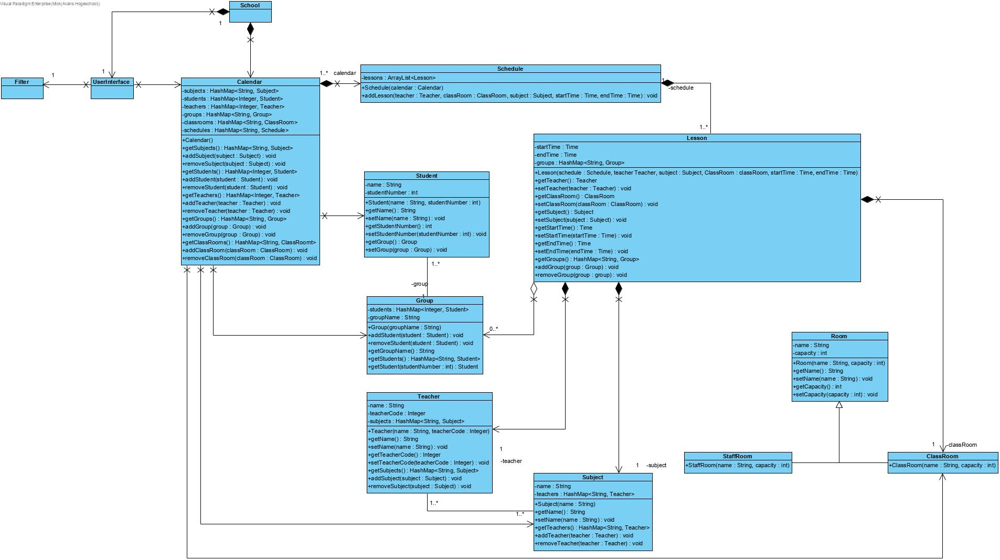

## Week 2

Vandaag ben ik bezig geweest met het bijwerken van het klassendiagram samen met twee uitmundende collega's. Tijdens het senior gesprek was duidelijk geworden dat er nog enkele aanmerkingen waren op ons ontwerp. Deze opmerkingen waren vooral gericht op het overgecompliceerde ontwerp gericht op de toekomst en de doorstroom van data.

Samen met Johan en de projectgroep zijn wij tot de conclusie gekomen dat we een tweetal opties hadden voor het verhelpen van deze aanmerkingen.

Ten eerste hadden wij het idee om een opslagpunt toe te voegen aan ons ontwerp, dit is uiteindelijk in onze calendar klasse terecht gekomen. Echter moesten wij deze nog door kunnen geven aan de andere klassen. De eerste mogelijkheid hiervoor was door middel van overerving. Deze keuze hebben volledig afgewezen omdat dit zou zorgen voor meer overgeërvde data dan nodig was.

Ten tweede, hadden wij nog een idee welke ons veel interessanter leek. Dit idee was om deze functie te vervullen door middel van de aanroepende objecten mee te geven in de constructors van de aangemaakte klassen. Dit was een successfol idee omdat we hiermee veel meer controle hielden over welke attributen en methoden gebruikt kunnen worden.

Uit ons harde werk is het volgende tussentijdse resultaat gekomen:

Hierna zijn we aan de slag gegaan met het verder uitwerken van de onderliggende methoden en hebben hier een aantal tests op los gelaten. Deze tests waren nog niet volledig omdat het interface nog niet functioneel was, maar hebben de methoden voor het aanmaken van de objecten getest.

Samen met de rest van de leden hebben we nog een aantal zaken besproken met betrekking tot bepaalde object typen. Hieronder viel de docentcode bijvoorbeeld, waarvoor we ten eerste een String roomType hadden gekozen voor 3 letter codes. Na bespreking hebben we ervoor gekozen om deze waarde een Integer te maken zodat beide objecten, wegens onze keuze om studentnummers ook als integers te gebruiken, zo gelijk mogelijk kunnen behandelen.

Hiernaast hebben we ook besloten om alle data, zoals alle subjects en teachers etc. op te slaan in HashMaps in plaats van ArrayLists. Dit zorgt ervoor dat het programma en wij veel minder zoekwerkt moeten verrichten elke keer als we een bepaald object willen opzoeken.

Ik ben hierna aan de slag gegaan met het aanpassen van het klassendiagram en deze up to date te maken. Dit is de versie, afgezien van het GUI, welke we mee verder gaan met het doortesten van alle onderliggende code en het maken van de koppeling met het GUI.

