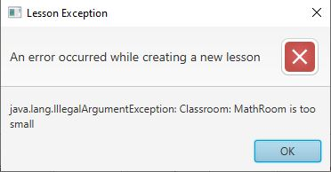
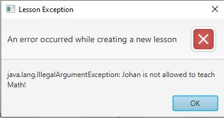

## Week 3

Op maandag ben ik samen met Wouter bezig geweest aan het technisch document. Wij waren hiervoor niet op school wegens bepaalde omstandigheden, maar hebben hier online samen aan kunnen werken.

Het technisch ontwerp was nog volledig leeg, echter na ons harde werk hebben we deze bijna volledig kunnen vullen voor de agenda module. Het werken met zijn tweeën was wel handig op bepaalde punten, bijvoorbeeld bij het beslissen van opmaakt etc.

Een grote beslissing welke we over hebben de weergave van het klassendiagram. We hebben ervoor gekozen om een gestripte versie in het docuement te plakken met daaronder de uitwerkingen per klasse.

Hierna zijn Wouter en ik samen aan het werk gegaan met het opvangen van errors en het controleren van conflicts. Voorheen vingen we dit nog niet af waardoor er errors konden ontstaan bij het runnen van de code. Nadat Wouter en ik onze magie erop hebben losgelaten hebben wij code laten verschijnen welke een error message laat zien. Hiermee voorkomen we dat het programma vastloopt en kunnen we de gebruiker een indicatie geven hierover.

In de loop van de week heb ik samen met wouter deze meldingen verder uitgewerkt en op alle relevante functies. Dit ging van getters en setters tot aan de nieuwere functies, waaronder het datafilter.

Het filter is het volgende onderdeel waar ik mee aan de slag ben gegaan. Het concept was al vroeg bekend, we willen alle data per subject, groep, etc. kunnen filteren. Tijdens het maken van het filter waren er 2 mogelijke implementaties.

De eerste mogelijkheid was om het filter toe te passen in het kalender object, maar tijdens de implementatie bedacht ik dat het veel overzichtelijker en netter zou zijn om het filter in aparte klassen op te delen, waarbij elke data roomType een aparte filter krijgt. Dit zorgt ervoor dat alle filters apart aangepast kunnen worden waardoor alle werkende code niet meer aangepast moet worden.

Het filter was gebaseerd op de ideeën welke wij gekregen hadden dijdens de OOM lessen. Hoewel niet direct gebaseerd op een pattern, het heeft wel inspiratie van opgedaan. Deze keuze heb ik besproken met de groep en nadat iedereen akkoord gaf heb ik deze bolledig geimplementeerd. Omdat deze code in een apart package zat was deze eenvoudig te integreren. Deze code is dan ook gemerged met de master en is kort daarna gebruikt binnen de scheduleviewer.

Bij afronding van deze week was ik helaas verhinderd. Ik had een persoonlijke afspraak en kon deze helaas niet verzetten. Ik heb wel nog bij mijn team informatie opgedaan over de status, waarbij bleek dat er nog een aantal puntjes op de i gezet moesten worden.