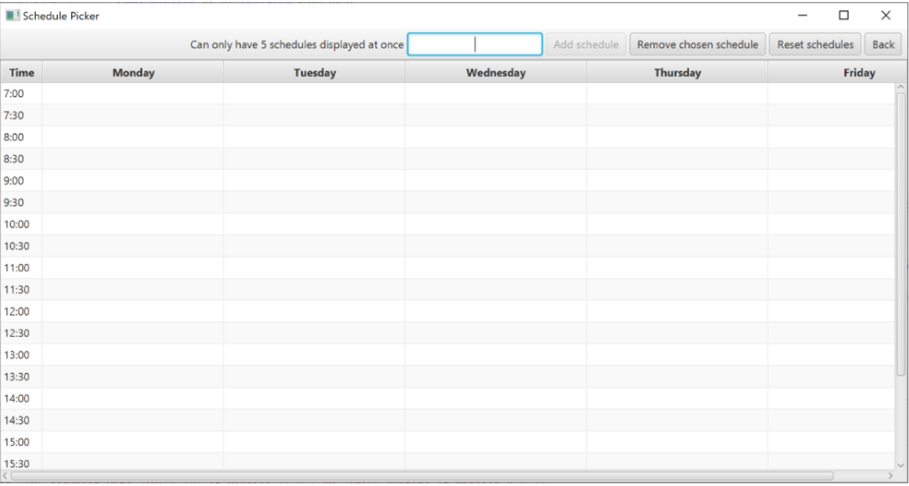
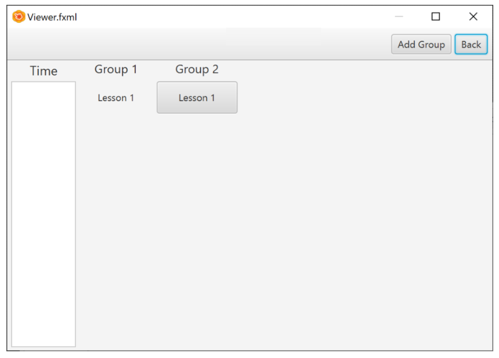
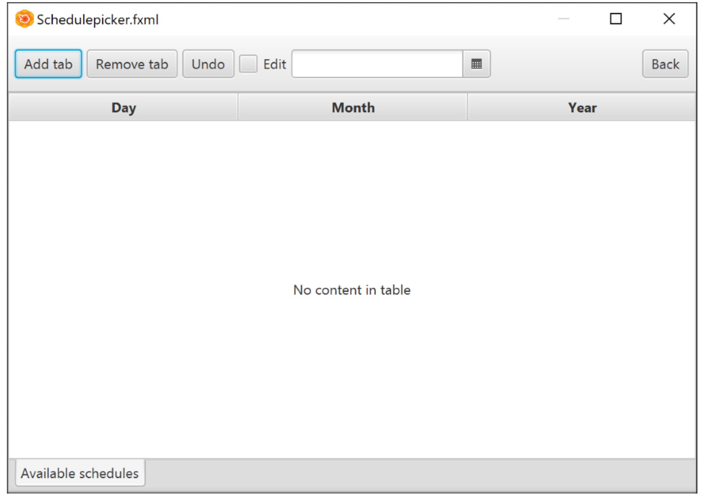

# Week 2

## Wat is de situatie (context)?

In week 2 had ik op maandag, dinsdag, donderdag en vrijdag aan de gui van mijn proftaak groep A2 gewerkt. Ik en Stijn hadden op maandag samen een ontwerp bedacht om hoe we de rooster van het schoolrooster module zou afbeelden. Dinsdag tot en met vrijdag werd er aan de gui gewerkt met Tom. In week 2 heb ik in totaal voor ongeveer 4 dagen of 22 uren en 20 minuten aan de gui gewerkt. In dit week hadden we een begin gemaakt aan de gui die we zal gebruiken in onze eindproduct. 
De verschillende onderdelen die ik had persoonlijk had gemaakt waren: De start scherm, het concept voor de ListView, het concept voor de TabPane, de save functie, de GUI die we gaan gebruiken voor het eindproduct.

## Welke keuzemogelijkheden heb je?

Tijdens de ontwerpfase van het GUI waarbij we samen aan verschillende ideeën had bedacht. De verschillende ideeën die we zijn opgekomen voor de GUI waren de volgende drie. Een TableView te gebruiken voor een dag of een week te laten afbeelden (zie figuur 1). Een ListView met tijden aan de linker kant van een BorderPane en een canvas die maakt gebruik van 2d graphics om in blokjes verschillende lessen af te beelden van een lesgroep/klas (zie figuur 2). Een andere mogelijkheid was dat we een TabPane gebruikte met verschillende tabs waaruit de gebruiker kan kiezen welke datum en rooster ze wilde zien en die aan een tab toevoegen (zie figuur 3).  Een keuze dat ik moest maken had te doen met de verschillende tijden zoals de allereerste tijd en allerlaatste tijd van de dag die je kon zien op een rooster. Ik had de mogelijkheid om alle tijden van een dag te kiezen of de begin en eind tijd van onze theoretische school.

 

Figuur 1  
Een TableView waarbij de gebruiker kan een rooster van een week laten afbeelden. 

Figuur 2  
Een ListView met tijden aan de linker kan en in het midden door middel van een canvas met 2d graphics wordt de verschillende ingevoerde roosters afgebeeld

Figuur 3  
TabPane met verschillende tabs die je kan toevoegen en een datum kiezen om een rooster af te beelden.

 ## Welke keuze heb je gemaakt?

We hadden gekozen om een TableView te gebruiken met tijden aan de linker kant van het GUI (zie figuur 1). Ik had de kezue gemaakt om de begin en eind tijden van een school te kiezen. In onze verzonnen school begint een lesdag vanaf 7:00 en eindigt op 18u. Op de tableview wordt de eerste tijd 7:00 met een vermeerdering van 30 minuten tot dat het school sluit, 18u.

## Waarom heb je deze keuze gemaakt?

Ik was niet de enige die de keuze hebt gemaakt. In het begin toen ik en Stijn samen aan ideeën ging verzinnen hadden we deze bedacht. Wij wilde definitief aan de linker kan een kolom die de tijden van een dag afbeeldt achter elkaar. Daarnaast wilde we verschillende roosters kunnen afbeelden met blokjes die begon op dezelfde rij als de begintijd en eindigt op de eindtijd, dus het zou de lengte hebben van de eindtijd min de starttijd. Wij hadden dit keuze gemaakt want we wilde het ongeveer dezelfde maken als de school rooster van Avans. Dat was wat het groep had samen besloten.
