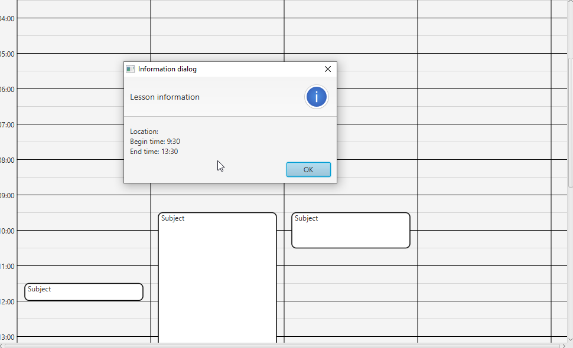

# Wekelijkse reflectie

*In de derde periode van Technische informatica op Hogeschool Avans, wordt van je verwacht dat je een wekelijkse reflectie schrijft over het project waar ik in deze periode aan ga werken. Zo kan ik reflecteren wat goed en fout gaat tijdens het projectwerken. Elke week werd ons gevraagd om te reflecteren door jezelf vier vragen te stellen, ten eerste wat de situatie is waar jij en je groep in zitten. Ten tweede welke keuzenmogelijkheden ik heb tijdens deze week, Ten derde welke keuzen je hebt gemaakt van de mogelijkheden in die week. Tot slot jezelf afvragen waarom je deze keuzes gekozen. *

## Week 1

### Wat is de situatie (context)?
De situatie waar we ons in bevonden was erg moeilijk, de eerste week is erg belangrijk aangezien er een goed ontwerp moet komen voor het product. Voor de meeste “TI’ers” die ik ken is het ontwerpen en verwoorden van de aanpak iets wat ze liever laten liggen, ook bij ons was dit het geval. Tot slot zijn we begonnen aan de analyse en het ontwerp en deze hebben wij na twee dagen kunnen afronden.

### Welke keuzemogelijkheden heb je?
Tijdens deze fase had ik erg veel keuzes. Ten eerste hoe onze userinterface er uit zou gaan zien. Ten tweede of we twee applicaties maken voor de roostermaker en de student of een applicatie waarin alle functies zaten. Tot slot heb ik de keuze gehad hoe de user omgaat met de userinterface. 

### Welke keuze heb je gemaakt?
We hebben nu besloten hoe het design van de userinterface er uit gaat zien, dit zullen balken worden waarbij de lengte overeenkomt met de tijd dat de afspraak is. Je kan roosters toevoegen op: groep, leraar en lokaal, als er een nieuw rooster wordt geopend wordt deze naast het andere rooster weergeven met een nieuwe strook waar lengte balkjes kunnen komen. Zie afbeelding 1 voor een visuele representatie.

### Waarom heb je deze keuze gemaakt?
We hebben de keuze gemaakt grotendeels, omdat we dit design vaker zien en weten dat het netjes is en goed werkt. Het is echter moeilijker om te maken dan bijvoorbeeld een lijst weergave.

## Week 2

### Wat is de situatie (context)?
In week twee kwam het programmeren naar voren. De ideeën die gemaakt zijn moeten nu gecodeerd worden. We kwamen er snel achter dat het moeilijk is om de tijdlijn te linken aan de bloklengtes van afspraken. Er waren meerde oplossingen naar het probleem en tot nu toe hebben wij nog niet de beste kunnen vinden. 

### Welke keuzemogelijkheden heb je?
De grootste keuzemogelijkheid die ik heb op dit moment is of de applicatie resizable moet zijn of niet. De code zal erg afhangen van deze keuze. Ten tweede moeten we door dit geval kiezen wat voor "pane" we gaan gebruiken en of we java2d gaan gebruiken. Grote design keuzes zoals deze hadden al gemaakt moeten zijn. Dat is waar ik achter ben gekomen.

### Welke keuze heb je gemaakt?
Tot nu toe hebben wij nog geen keuze kunnen maken, op dit moment zijn wij een design aan het proberen met de TableView. Dit zou dan de mogelijkheid hebben dat het resizable is. Deze keuze zit nu in de laatste versie van de code.

### Waarom heb je deze keuze gemaakt?
Nogmaals is de keuze voor een TableView gemaakt door de mogelijkheid resizable open te stellen. De TableView werkt tot nu toe erg goed met de structuur te behouden tijdens resizing. Ook het toevoegen van items in de TableView is erg ordelijk en aangenaam.

# Week 3

### Wat is de situatie (context)?
Week drie was een drukke week, er moesten veel dingen af en er waren nog genoeg dingen om te doen. Mijn taak was om de lessen van ons rooster visueel mooi te weergeven op de applicatie. Eerst in week 2 was dat gedaan door een TableView. Deze tableview was echter niet precies wat we zochten dus er kwam snel al iets nieuws. Na een tijd onderzoeken vond ik de geweldige ScrollPane, dit is een pane soort waar de pane groter kan zijn dan het window van de applicatie. Dat is erg handig aangezien een rooster veel info moet kunnen laten zien. Daarnaast moest ik een manier vinden om de lessen zo te weergeven dat de tijd gelijk staat aan hoe lang het blokje is wat je kan zien.

### Welke keuzemogelijkheden heb je?
Ten eerste moest ik zoeken naar een andere manier om het rooster te weergeven i.p.v de TableView. Dus dat was mijn eerste mogelijkheid, hoe ga ik de blokjes per les laten weergeven op het scherm op een mooie manier. Ten tweede was er veel keuzemogenlijkheid in het kiezen tussen wat voor vakjes we gaan gebruiken. Ten derde moest er een keuze gemaakt worden in de manier dat de informatie van de les weergeven wordt. Tot slot moest ik kiezen of ik javafx ging gebruiken of dat ik de FXgraphics2D library ging gebruiken samen met javafx.

### Welke keuze heb je gemaakt?
Ten eerste heb ik gekozen om de scrollpane te gebruiken om het rooster op te printen. Dit lukte goed en ik was snel op weg met het maken van een tijdlijn en daarna de lesblokken. Ten tweede heb ik ervoor gekozen om de lessen met Rectangles te renderen, deze rectagles heb ik vervolgens wit ingekleurd met een zwarte rand. De rectagles hebben ook een arc gekregen op de hoeken. Ten derde heb ik ervoor gekozen om de rectangles klikbaar te maken zodat als je erop klikt dat er dan een dialog venster komt met de benodigde info. Tot slot waren deze keuzes genoeg om een goede roosterweergave te creëren dus ik heb alleen maar de javafx library gebruikt.

### ^ scrollbar
> Hier zie je de scroll bar die beschikbaar is als je gebruikt maakt van een Scrollpane

### Waarom heb je deze keuze gemaakt?
Ik heb de keuze van de scrollpane gekozen, omdat je makkelijk een dynamisch scrollbaar object kan maken zonder je zorgen hoeven te maken of alles goed mee beweegt met scrollen, een scrollpane is gewoon een veld waar je dingen kan plaatsen en die blijven in principe op dezelfde plek. Het enige wat aanpast is de ViewPort van de scrollpane, deze schuift mee met de gebruiker inputs. Ten tweede heb ik gekozen voor rectagles voor de lesblokken, omdat deze simpel te maken zijn en hun werk prima doen. Ten derde heb ik gekozen voor een dialog om informatie te weergeven aangezien het aardig snel werkt en het is simpel, ook omdat niet alle informatie past in het lesblok van het rooster. Tot slot was de keuze van javafx meer gebaseerd op dat het niet echt nodig was om andere dingen te gebruiken zoals de 2D graphics library.

# week 4

### Wat is de situatie (context)?
Deze week was voor het afronden van de roostermodule en voor het beginnen aan de simulator. Ik werd toegewezen om te beginnen met de simulatie module. Deze week kregen wij info over het inladen van Tile Maps tijdens het opstartcollege. Met gebruik van deze informatie moet ik deze week een stuk software maken dat de "Tiles" inlaad van onze school map. Ook is wordt deze week de school map gemaakt in Tiled, dit programma maakt met gebruik van sprite textures het maken van een map erg gebruiksvriendelijk.

### Welke keuzemogelijkheden heb je?

Ten eerste moest ik gaan kiezen hoe de klasse verdeling gaat worden i.v.m. het inladen van de map. Ik moet kiezen hoe ik dit ga doen en of ik Java 2d ga gebruiken of JavaFX. Ten tweede kwam de keuze in wat voor soort school we gaan maken, aangezien we de map moeten ontwerpen voor de simulatie kwam er een mogelijkheid voor een thema. Omdat ons team van een leuke uitdaging hield hebben we gekozen om een thema te doen. Tot slot kwam de keuze hoe we de 60 fps simulatie gaan doen.

### Welke keuzes heb je gemaakt?

Ten eerste was ik begonnen met een skelet van de simulator. Ik had een klasse simulator waar de AnimationTimer aanwezig is en dit is in principe de Core van onze simulator, hier komen alle updates in. Het eerste probleem waar ik tegenaan liep was dat de AnimationTimer niet een vaste loop tijd had per laptop, laptops met een hoger refreshrate monitor zullen meer updaten dan laptops met een lager refreshrate monitor. Ik heb dit opgelost d.m.v. een timer die bijhoud hoelang tussen de updates zit, deze timer zorgt er voor dat de software een bepaald aantal keer per seconde zal gaan vernieuwen. Dit zorgde ervoor dat de updates nu overal op elke laptop gelijke snelheid hebben. Naast die klasse kwam er een school map klasse, deze klasse zal het weergeven en het inladen van de map mogelijk maken. het programma Tiled waar wij onze school map hebben gemaakt, maakt een Json file waar een array in staat waar je coördinaten uit kan halen en waar je de index van de texture kan vinden. Uit de array samen met de textures kan je nu met een array een gehele map inladen. Aangezien ik de json niet mooi vond van het Tiled programma heb ik een nieuwe gemaakt voor het bewaren van onze map.

> De afbeelding hierboven zijn de textures waar in de tekst naar verwezen wordt. ^

> Hierboven weergeven zie je hoe de plaatjes worden verdeeld om een groter geheel te maken. Zo werkt onze map hieronder weergeven ook! Allemaal kleine plaatjes als een puzzel naast en onder elkaar.

> De afbeelding hierboven is voor deze week de uiteindelijke school map. ^

> Het plaatje hierboven is een voorbeeld van de Array die het programma Tiled maakt om een map laag toe te voegen. ^

### Waarom heb je deze keuzes gemaakt?
De keuze voor de twee klasse heb ik gemaakt om de verantwoordelijkheid te verdelen tussen de simulator en de map inladen. Dit zal het programmeren een stuk overzichtelijker en modulair maken. De Timer heb ik gedaan, omdat anders de simulator op sommige laptops andere frame tijden heeft, dit zal de simulator ook sneller laten lopen. Daarom koos ik voor de Timer om de frame tijd te handelen. Ik heb een eigen json file gemaakt om de map array te bewaren omdat bij de Tiled json er veel labels niet gebruikt waren en overbodig. Zoals het plaatje hieronder zijn er variabele die niet gebruikt worden.

> Hier zie je hoe de labels er uit zien in de json.

# week 5

### Wat is de situatie (context)?
Deze week werden de taken verdeeld tussen aan de simulator werken en aan de rooster module, aangezien deze nog niet helemaal af is. Volgens Johan (Senior van het project) moest onze structuur voor het inladen van de map beter. Voorheen maakte we een eigen json met alle map data, maar dat is onhandig door het opslaan van Tiled. Ten tweede werd uitgelegd hoe we onze npc's de weg gaan laten leiden naar de goede plek. We hebben besloten om alvast een start te maken in het maken van pathFindind voor onze npc's. Deze week gingen we na besluit alvast werken aan de dynamische delen van de simulator, zoals de npc's, de klok van de simulatie en de path finding. 

### Welke keuzemogelijkheden heb je?
De eerste keuze die gemaakt werd was welke manier we gaan path finden. Om de npc's een pad te geven waar ze via lopen heb verschillende manieren en we gaan er maar een gebruiken. Ten tweede zochten we een manier om de npc's die je op scherm ziet te verbinden met de students in het rooster die lessen en tijdens bevatten. Ten derde zochten we een plek waar we al die npc's gaan sturen en initialiseren. Tot slot hebben we de keuze hoe de npc zich gaat afbeelden op het scherm.  

### Welke keuzes heb je gemaakt?
Johan vertelde aangezien we gebruik maken van weinig niet dynamische locaties en van veel npc's, dat het maken van een distancemap per locatie ons pathfinding probleem vrij simpel zou oplossen. Dus wij zijn begonnen met het maken van een algoritme dat met een locatie en een map een DistanceMap kan maken. Een distance map is een map met Tile een nummer met hoeveel stappen het kost om naar de origin locatie te gaan. Elke map heeft een beginpunt dat start bij 0, dit punt is altijd het eindpunt als je zou aftellen van de plek waar je bent. We hebben voor de tweede keuze gebruik gemaakt van twee verschillende klasse, de eerste klasse blijft hetzelfde met alle data voor het rooster wat ook opgeslagen wordt. De tweede klasse wordt een klasse waar een locatie, een hitbox, een avatar en een eindpunt worden vastgehouden. Deze klasse wordt de container voor elk van de simulatie studenten. Ik heb aan het eind van de week een klasse gemaakt waar alle npc's worden gemaakt en gestuurd, deze klasse maakt gebruik van de pathfinding en van de klok en tot slot van de calendar om alle npc's te sturen naar lokalen. Tot slot omdat we wat voorliepen hebben we besloten om een sprite manager begin te bouwen die de verschillende sprites van de npc's te ondernemen dat het popetje de goede sprite heeft per hoek van lopen.

> Enig uitleg over het algoritme wat we gebruit hebben.

> Hier kunt u zien dat het niet uitmaakt welk vakje je pakt, je kan altijd met aftellen bij de ster komen op de snelste manier.

### Waarom heb je deze keuzes gemaakt?
We hebben de keuze van distanceMaps gekozen door Johan. Hij vertelde dat deze manier van pathfinding erg efficiënt is in ons context. Aangezien er weinig locaties zijn waar de studenten heen moeten kunnen we bij initialisatie alle mappen maken vanwaar een lokaal is of kantine of wc, en vervolgens alleen nog die mappen gebruiken per npc. Hierdoor wordt er na het initialiseren niet meer berekend hoe een npc moet lopen, elk npc hoeft alleen voor het laagste aantal stappen om zich heen zoeken. De keuze voor het maken van aparte student npc klassen kwam doordat wij nu de datastream van het student object opslaan tijdens het opslaan van het schoolrooster, als we in deze klasse ook de npc dinamieken gingen maken, zouden we deze ook opslaan. En dit opslaan is overbodig.

# week 6

### Wat is de situatie (context)?
Vorige week hebben wij de distanceMaps gemaakt. Deze week ga ik proberen de Npc's op deze distanceMaps te laten werken. Zo dat de Npc's het snelste pad vinden naar hun locatie. Het aansturen van de Npc's naar ieder lokaal is nog niet gedaan dus het debuggen gaan we doen door hard gecodeerd locaties aan te wijzen om te checken of ze goed lopen. Ook hebben we een Camera nodig die goed kan zoomen en slepen naar gewenste viewPort. Hiervoor moet een nieuwe Camera klasse komen. Tot slot moeten we de connectie tussen alle distanceMaps en hun lokaal maken, zodat deze bij init() gegenereerd zullen worden.

### Welke keuzemogelijkheden heb je?
Ten eerste kwamen we op de optie om de distanceMaps mee te geven aan elke Npc of een single instance klasse. Hierbij moeten we afwegen wat het best past bij onze structuur. Ten tweede kwam de mogelijkheid om de Npc's te sturen vanaf de simulator klasse of vanaf een nieuwe klasse. Hierbij moeten we ook kijken of het wel waard is om een aparte klasse te maken. Tot slot kwam de keuze voor de camera, of we gebruik gaan maken van transformaties of gebruik gaan maken van de scrollPane.

### Welke keuzes heb je gemaakt?
Ten eerste hebben we gekozen om een path finding klasse te maken die alle distanceMaps bij init() mee krijgt. Deze klasse bestaat uit een aantal methode, de belangrijkste is de getNextStep. Deze methode heeft een locatie nodig en een naam van de finnish en geeft de volgende position mee van de tile die volgens de distanceMap het dichtst bij zit. Ten tweede hebben we gekozen voor een Npc manager klasse te maken, deze klasse heeft de tijd in de gaten en heeft het rooster, alle Npc's en de pathfinding module. Deze manager wordt ge-update en zal voor elke npc een doel doorgeven waar ze heen moeten op de goede tijdstippen van het rooster. Tot slot de heb ik de camera gemaakt in een apparte klasse met transformaties en scaling, deze zit vast aan het canvas.

### Waarom heb je deze keuzes gemaakt?
De pathfinding module hebben we gekozen aangezien een Npc straks door collision geduwd kan worden, als we bijv. een pre-loaded pad zouden mee geven zou dat extra fout handeling nodig hebben, dus we hebben gekozen dat de Npc per stap vraagt aan de pathfinding module welke tile next is. Ten tweede hebben we gekozen voor een Npc manager omdat er uiteindelijk nog vrij veel data en verantwoordelijkheid te pas kwam. Deze npc manager werkt een stuk overzichtelijker op deze manier.

# Week 7

### Wat is de situatie (context)?
Deze week ga ik proberen de Npc's aan te sturen en te spawnen door de lessen op te vragen uit de calender. Onze simulatie kan nu studenten spawnen en naar een locatie sturen dmv een string van de naam van de plek. Ook heeft one simulatie nu een werkende camera wat erg helpt met het debuggen.

### Welke keuzemogelijkheden heb je?
Ik heb de keuze om de npcManager de caleder te laten lezen en dat deze klasse alle studenten individueel aanstuurt of het schedule en de tijd meegeven aan de studenten.

### Welke keuzes heb je gemaakt?
Ik heb de keuze gemaakt om de npcManager alle npc's individueel aan te sturen.

### Waarom heb je deze keuzes gemaakt?
Ik heb de keuze gemaakt om de npcManager alle npc's te sturen, omdat de klasse npc alleen de movement en het tekenen beheerst. De andere verantwoordelijkheid is van de npcmanager.

# Week 9

### Wat is de situatie (context)?
Deze week was een hele belangrijk voor de simulator. Ik kreeg te horen van onze Senior dat het gebruik van FXgraphics2D verplicht is. Dus deze week ga ik alles een refactor geven waar tekenen te pas komt. Ook ga ik deze week de teachers aansturen, de teachers zijn hetzelfde als de studenten naast de plek die ze krijgen in het klaslokaal en ze gaan i.p.v. de kantine naar de lerarenkamer. Ook ga ik het spawnen netter uitzetten dat de npc's niet colliden in de spawn, ook ga ik het leaven van de npc's maken. Tot slot ga ik de gehele simulator nogmaals nalopen en opschonen.

### Welke keuzemogelijkheden heb je?
Deze week heb ik de keuze om het spawnen van de npc's te doen wanneer hun eerste les begint of wanneer de school begint. Ook heb ik de keuze of de npc's weg gaan als ze klaar zijn met hun laatste les. Het spawnen van de npc's moet anders, aangezien de teachers nu erbij zitten. Ik had de keuze om alles in te spawnen aan het begin van de simulatie en de npc's nog niet visible te maken. Of ik zou nieuwe studenten creeren op de tijd dat ze horen te spawnen.

### Welke keuzes heb je gemaakt?
De studenten komen naar school 5 minuten voor hun eerste les. Na de laaste les vertrekt de gehele klas ook. De teachers komen standaart 8:25 naar school en vertrekken wanneer de laatste les die ze geven voorbij is. Voor het spawnen maakt de npc manager een spawnqueue. Deze queue kan vol zitten met zowel teachers als studenten. deze queue zit in een hashmap met een spawntijd erbij. Het spawnen is in ons opzicht het toevoegen van de npc aan de visible npc lijst en de collision.

### Waarom heb je deze keuzes gemaakt?
Ten eerste zijn de spawn en leave regels in mijn opzicht het meest acuraat met hoe het normaal in het echt ook gaat, het zou anders kunnen maar dit is het geworden. Ten tweede heb ik gekozen voor de spawn queue, omdat mij dat makkelijk leek voor zowel studenten als teachers tegerlijkertijd te spawnen.

### Reflectie over dit project
Dit project heb ik veel geleerd over werken in een ingewikkeldere datastructuur. Tijdens het schrijven van de rooster view merkte ik echt dat de structuur moeilijk was. Ik heb geleerd om de ingewikkelde data structuur te gebruiken als mijn voordeel, door de regels van de structuur niet nogmaals toe te passen. In andere woorden zal mijn stuk simulatie altijd de caledar gehoorzamen ookal zou er niks van kloppen (bijv dezelfde lessen tergerlijkertijd). Maar omdat de fouten er uit gefiltert worden door de calendar hoeft dat niet nogmaals in de simulatie. Dit scheelt veel check-werk voor de simulatie. Ten tweede heb ik veel geleerd over performance bij de npc's. De acties per npc kunnen erg kostbaar worden naarmate het aantal npc's stijgt. Hier moet je goed gaan kijken wanneer er bijv gecheckt wordt of er een les bijna begint. Tot slot heb ik het volgende geleerd over FXgraphics:

### Mening over FXgraphics2D
Na deze week heb ik een gevoel gekregen of het makkelijker was om de simulatie te laten lopen op alleen javaFX of javaFX met de FXgraphics library. Naar mijn mening werkt het opzetten van de draw code voor elke klasse erg goed! Ik had de transitie aardig snel werkend. Echter performance wise is FXgraphics duidelijk minder goed, Na de gehele transitie zit er een gekke jidder in de simulatie elke halve sec. Ik heb na deze jidder gezocht in de code en kwam op een interesante conclusie. Tijdens het zoeken ging ik erg veel zoeken in de performance van alle npc's aangezien ik het logisch vond dat de performance lack daar zou liggen, niet dus! zelfs zonder npc's en zonder update zat de jidder nogsteeds in de simulatie. Tot slot ben ik gaan kijken naar de map, hier lag het probleem! Het tekenen van alle plaatjes zorgt voor een volle buffer denk ik? Het algoritme om de map te tekenen lag het ook niet aan, zonder de draw functie maar met het tile algritme ging de performance ook door het plafond.

### In het bedrijfsleven wordt veel gebruik gemaakt van javaFX
Dit komt door het grootste voordeel van JavaFX: De flexibiliteit die zich meebrengt. Met javaFX kan je namelijk user intefaces maken voor web, mobiel en desktop. Dit voordeel is erg relevant aangezien je met 1 stuk code meerdere doelgroepen kan voorzien, terwijl er normaal verschillende code vereist is.

https://blogs.oracle.com/java-platform-group/the-future-of-javafx-and-other-java-client-roadmap-updates

https://dzone.com/articles/one-guys-perspective-on-javafx

### Json
Ik denk dat Json veel gebruikt wordt ten eerste in games, zoals de simulatie in de tile map. Ten tweede wordt json veel gebruikt bij applicaties die een contacten lijst moeten onthouden. Tot slot wordt json veel gebruitk door applicaties die een kleine omvang hebben maar wel veel data moeten bewaren. Dit komt omdat:

- Json wordt gebruikt om je data georganiseerd te bewaren in een leesbare manier. 
- Voor de software is het gemakkelijk om bij de data te kunnen in een json. 
- Json files zijn makkelijk om aan te passen en te creeren.

#### Erg mooie uitleg van het concept Json:
— The Concept of JSON —

Imagine the country Norway wanting to send some important piece of information to the country Spain. Now, how do they go about doing this?

Norway could send the message in Norwegian and let Spain find a person who knows both Norwegian AND Spanish, and is able to translate from one language to the other.

Or Norway could find someone who knows both Norwegian AND Spanish, and first translate the message from Norwegian to Spanish, and then send it over.

In either case, we need someone who knows both of the languages.

If Norway and Spain want to send messages back and forth to each other, both of them need someone who knows both of the languages.

Isn’t that making things a bit too complicated? What if we could make things simpler by incorporating a new language that both understand? That would certainly make things simpler, right?

Enter the lingua franca, English. If both Norway and Spain instead use the English language to send their messages back and forth, neither of them would need to know Spanish or Norwegian. It’s just one common language used to understand each other.

However, for the sake of understanding, let’s say the English is only the language for communication between the countries. When Norway receives a message in English from Spain, they would still need to translate it to Norwegian — because reasons!

Likewise, if Spain were to receive a message in English from Norway, they would still have to translate it into Spanish to, let’s say.. uhh.. to further work with their laws which are specifically in Spanish! (play along with me here)

But, why then learn English if they’re anyways going to translate it back to their native language?

Imagine that Norway and Spain don’t only send message to each other, but also communicate with France, Pakistan, Switzerland and Russia. All those countries have their own languages. Having to know and translate to all those languages would be pretty difficult, don’t you think?

Instead, each country knows English in addition to their own language. Then, any country can send a message to another country in English, and then the receiving country can translate from English to their own language. There’s now one universal language for communication!

That’s the idea of JSON. Instead of understanding how any of the programming languages work, there is a common “language” solely used for communication.

